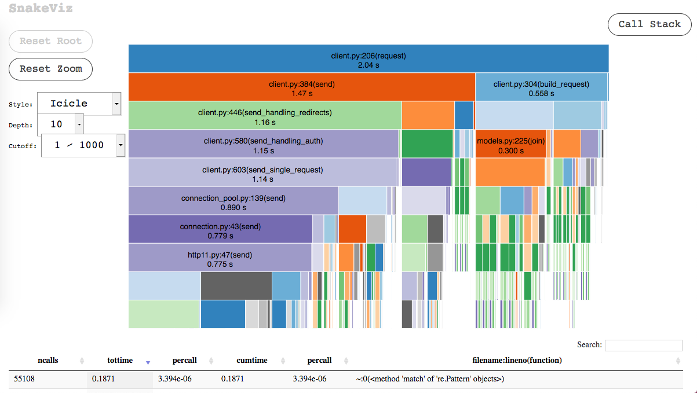

# httpxprof

A tool for profiling [HTTPX](https://github.com/encode/httpx) using cProfile and [SnakeViz](https://jiffyclub.github.io/snakeviz/). No maintenance intended.



## Installation

- Install the version of HTTPX you'd like to profile against.
- Install this tool using pip:

```bash
pip install -e git+https://github.com/florimondmanca/httpxprof#egg=httpxprof
```

## Usage

```bash
# Run one of the built-in profiling cases:
httpxprof run async_client

# View results:
httpxprof view async_client
```

You can also:

- Run your profiling cases by passing Python scripts — useful to profile other HTTP client libraries.
- Profile against an HTTPS server using the `--https` option.

```python
# aiohttp_single.py
import aiohttp
import ssl

import httpxprof


async def main(config: httpxprof.Config) -> None:
    ssl_context = ssl.create_default_context(cafile=config.client_cert())
    async with aiohttp.ClientSession() as session:
        for _ in config.requests():
            async with session.get(config.url, ssl=ssl_context):
                pass
```

```bash
httpxprof run --https aiohttp_session.py
httpxprof view aiohttp_session.py
```

You can ask for `--help` on `httpxprof` and any of the subcommands.
